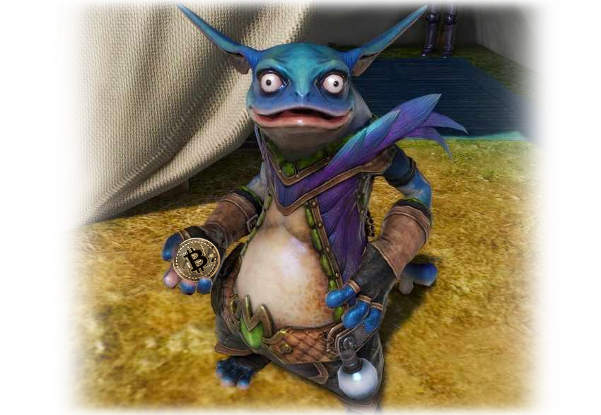

    

# DaruBot

Trading bot, uses exchanges API for monitoring price and make decisions to place or close orders

# Supports Exchanges

* Bitfinex

# Features

## Strategies

### Default

dumb strategy, like your 3-year-old sister saw the price chart for the first time

## Integrations

Provide notifications and commands like start/stop, close all positions.  

### Telegram

Make your own bot and provide token

| Service          | Notifications     | Controls |
| - | - | - |
| Telegram       |  ✅      |  ✅  |
